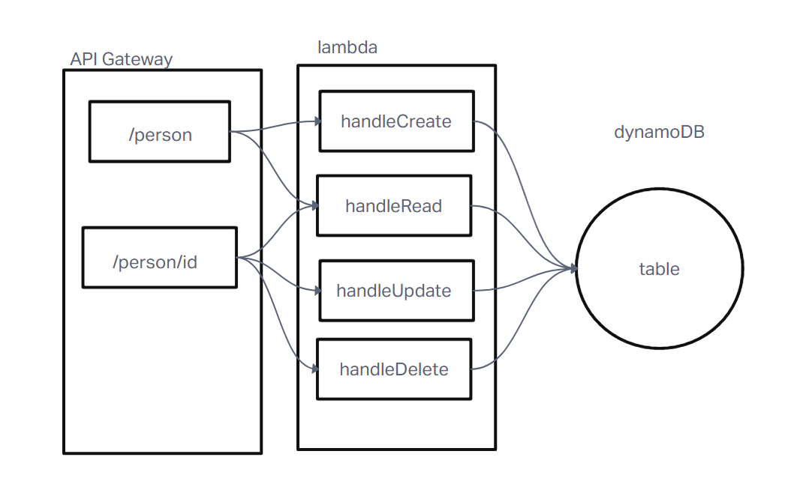

# README

[api-url](https://van4lh8gwa.execute-api.us-west-2.amazonaws.com/dev/people)

Colab with Jordan, Adrienne, and Ty

handleRead - checks if an id is passed as a param, if not it returns all items in the db. Otherwise it returns the item that matches the id.

handleCreate - creates a new item in the db

handleUpdate - updates the item by id with what is passed in the body

handleDelete - deletes the item that matches the id.

